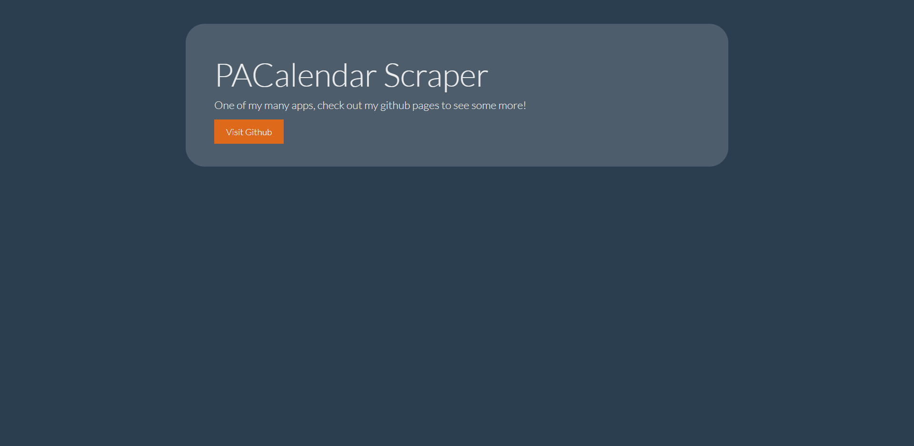

# PACalendar - Web Scraper

One of the initial steps to getting the PACalendar app functional was getting events into it. At
first, the team wasn't overflowing with student organization's that immediately wanted to spend
time signing up for an account and transferring all of their events over to an app that was still
in the "highly experimental" phase. We weren't even sure if this was going to be a long term
application at first. So what we ended up doing was scraping Penn State's Center for Performing
Arts calendar from the webservice "25 Live".

Originally my idea was to query some sort of external API for the data and then run the event
against a Tensorflow system to automatically create events but seeing as how there was no API
exposed, I had to get hacky. What I ended up landing on was creating a Web Scraper using cheerio
that enabled me to rip their static HTML files' data and allow for us to read the event data as we
entered it into the event creation form.

## The process

The process that I wrote runs every half hour against the entire current and next calendar year.
What this ended up doing was comparing, deleting, and condensing all of the events into one slug
that I then was able to send to my API and push into my Firebase Realtime Database with an update
statement.

## The website

I decided at the last minute that if I was going to have this as an always-on process I might as
well through a site underneath of it with some purpose! So I created a small EJS file that enabled
me to redirect curious visitors to my profile.

